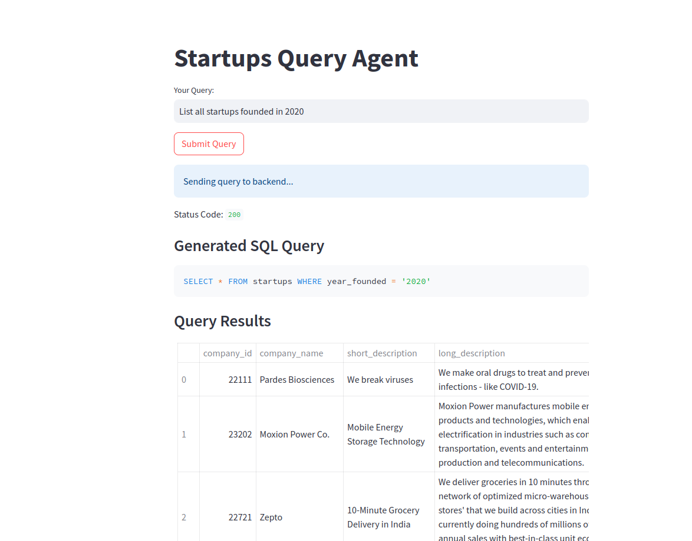

# Startups Query Agent

## **Demo**

Below is a demonstration of the **Startups Query Agent** in action:

<p align="center">
  
</p>

## **Overview**

Startups Query Agent is a comprehensive platform that collects, processes, and queries startup-related data with a focus on intelligent querying and user-friendly interaction. The platform leverages tools like Scrapy for web scraping, an LLM-based SQL Agent (using Ollama's Llama 3.2 model) for natural language queries, Streamlit for an interactive frontend, and FastAPI for backend API services. The data pipeline is designed to be robust, modular, and easy to set up.

---

## Features

- **Data Scraping:** Efficiently scrapes structured data of startups from Y Combinator using Scrapy.  
- **ETL Pipeline:** Extracts, transforms, and loads data into an SQLite database for querying.  
- **SQL Agent Integration:** Uses an LLM-based SQL Agent powered by Ollama's Llama 3.2 model for natural language queries.  
- **Interactive Frontend:** Provides a Streamlit-based user interface for insights and queries.  
- **Scalable Backend:** Uses FastAPI to handle API requests between the frontend and database.  
- **Docker Support:** Fully containerized for easy deployment and scaling.

---

## Project Structure

```
Startups-Query-Agent/
├── Untitled.ipynb                  # Jupyter Notebook for prototyping and testing
├── .gitignore                      # Git ignore file
├── docker-compose.yml              # Docker Compose configuration for backend and frontend
├── setup.sh                        # Script to set up the virtual environment and dependencies
├── requirements.txt                # General dependencies for the project
├── README.md                       # Project documentation (this file)
├── LICENSE                         # License file
├── a.py                            # Script to print folder structure
├── backend/                        # Backend service folder
│   ├── Dockerfile                  # Dockerfile for backend services
│   ├── db_setup.py                 # Database setup and migration script
│   ├── requirements.txt            # Backend-specific dependencies
│   ├── etl.py                      # ETL script for transforming scraped data
│   ├── app.py                      # FastAPI application file
│   ├── query_agent.py              # SQL Agent setup using an LLM (via Ollama, model "llama3.2")
├── data/                           # Folder containing database files
│   ├── database.db                 # SQLite database for processed data
├── YC-Scraper/                     # Folder for scraping-related code
│   ├── .gitignore                  # Git ignore file for the scraper
│   ├── requirements.txt            # Scraper-specific dependencies
│   ├── README.md                   # Scraper-specific documentation
│   ├── scraper/                    # Scraper implementation folder
│   │   ├── scrapy.cfg              # Scrapy configuration file
│   │   ├── Dockerfile              # Dockerfile for the scraper (if containerizing the scraper)
│   │   ├── data/                   # Folder for input and raw data
│   │   │   ├── start_urls.txt      # List of URLs to scrape
│   │   ├── scripts/                # Additional utility scripts
│   │   │   ├── yc_links_extractor.py  # Script to extract Y Combinator links
│   │   ├── scraper/                # Scraper output data folders
│   │   │   ├── data/
│   │   │   │   ├── raw/            # Folder for raw scraped data
│   │   │   │   ├── processed/      # Folder for processed data
│   │   │   │       ├── processed_data.csv
│   │   ├── ycombinator/            # Y Combinator-specific scraper logic
│   │   │   ├── pipelines.py
│   │   │   ├── items.py
│   │   │   ├── middlewares.py
│   │   │   ├── settings.py
│   │   │   ├── __init__.py
│   │   │   ├── spiders/            # Spider definitions
│   │   │   │   ├── yscraper.py
│   │   │   │   ├── __init__.py
├── backup/                         # Backup of older data or experiments
│   ├── 2023-02-27-yc-companies.csv
│   ├── scraped_data.csv
├── frontend/                       # Frontend service folder
│   ├── Dockerfile                  # Dockerfile for frontend services
│   ├── requirements.txt            # Frontend-specific dependencies
│   ├── app.py                      # Streamlit application file
```

---

## Installation and Setup

### Prerequisites

- Python 3.10+
- pip
- Docker (for containerized setup)
- Docker Compose (for orchestrating containers)
- **Ollama Installation:**  
  Ensure that [Ollama](https://ollama.com) is installed on your system (macOS is currently the primary supported platform) and that the model "llama3.2" is available.  
  You can pull the model using:
  ```bash
  ollama pull llama3.2
  ```
  *(Run this on a supported system where Ollama is fully functional.)*

---

### Step 1: Clone the Repository

```bash
git clone git@github.com:YourUsername/Startups-Query-Agent.git
cd Startups-Query-Agent
```

---

### Step 2: Set Up the Virtual Environment (For Local Development)

```bash
bash setup.sh
```

---

### Step 3: (Optional) Configure Ollama

Make sure Ollama is installed and the model "llama3.2" is available.  
If you're on macOS, run:
```bash
ollama pull llama3.2
```
For Docker, the backend container uses the Ollama Python client to work with "llama3.2".

---

### Step 4: Run the Scraper

Navigate to the scraper directory and run the Scrapy crawler:

```bash
cd YC-Scraper/scraper
scrapy crawl yscraper
```

This saves raw scraped data in `YC-Scraper/scraper/scraper/data/raw/scraped_data.csv`.

---

### Step 5: Process the Data

Run the ETL script to process and store data into the SQLite database:

```bash
cd ../..
python3 backend/etl.py
```

---

### Step 6: Start the Backend API (For Local Development)

Run the FastAPI backend:

```bash
cd backend
python3 -m app
```

The API will be accessible at `http://127.0.0.1:8000`.

---

### Step 7: Start the Frontend (For Local Development)

Launch the Streamlit frontend:

```bash
cd frontend
streamlit run app.py
```

Access the app at `http://127.0.0.1:8501`.

---

## Docker Deployment

This project is fully containerized using Docker. Follow these steps to build and deploy using Docker and Docker Hub.

### Docker Files

- **Backend Dockerfile:** Located at `backend/Dockerfile`
- **Frontend Dockerfile:** Located at `frontend/Dockerfile`
- **Docker Compose File:** Located at the project root (`docker-compose.yml`)

### Example `docker-compose.yml`

```yaml
version: "3.8"
services:
  backend:
    build:
      context: .
      dockerfile: backend/Dockerfile
    image: muhammadsheraza002/startups-backend:latest
    container_name: startup-query-agent-api
    ports:
      - "8000:8000"
    environment:
      - CHATOOLOMA_MODEL=llama3.2

  frontend:
    build:
      context: .
      dockerfile: frontend/Dockerfile
    image: muhammadsheraza002/startups-frontend:latest
    container_name: startup-query-agent-frontenmd
    ports:
      - "8501:8501"
    depends_on:
      - backend
```

### Steps to Deploy on Docker Hub

1. **Build the Docker Images:**

   From the project root, run:
   ```bash
   docker build -t muhammadsheraza002/startups-backend:latest -f backend/Dockerfile .
   docker build -t muhammadsheraza002/startups-frontend:latest -f frontend/Dockerfile .
   ```

2. **Log in to Docker Hub:**

   ```bash
   docker login
   ```

3. **Push the Images:**

   ```bash
   docker push muhammadsheraza002/startups-backend:latest
   docker push muhammadsheraza002/startups-frontend:latest
   ```

4. **Deploy Using Docker Compose:**

   On your deployment server or local machine, ensure your `docker-compose.yml` is updated as above, then run:
   ```bash
   docker-compose up -d
   ```
   This will start two containers:
   - **startup-query-agent-api** for the FastAPI backend (port 8000)
   - **startup-query-agent-frontenmd** for the Streamlit frontend (port 8501)

---

## Usage

- **Query Startups:**  
  Use the Streamlit app at `http://localhost:8501` to enter natural language queries (e.g., "List all startups founded in 2020").
- **Advanced Use Cases:**  
  Access the FastAPI endpoints at `http://localhost:8000` for direct API interactions.

